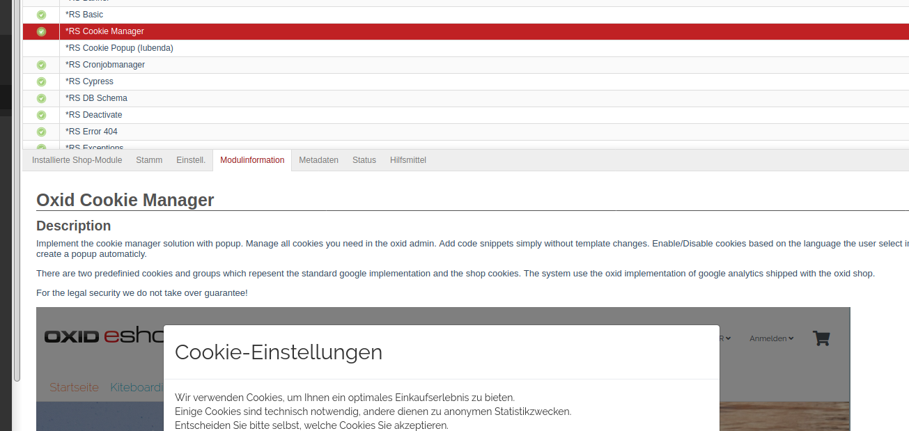

# Oxid markdown

Module based on code of https://github.com/OXIDCookbook

## Description

Test if there is a README.md or README_#LANGABBR#.mb in the module folder. If yes, the system display the Markdown file 
in the modules section as new tab. This module also display images if present in the markdown file.

Module was created for Oxid 6.1/6.2

## Install (manual)

1. Copy files into following directory
        
        source/modules/rs/markdown
        
2. Add to composer.json at shop root
  
        "autoload": {
            "psr-4": {
                "rs\\markdown\\": "./source/modules/rs/markdown"
            }
        },

3. Install dependencies 

        composer require michelf/php-markdown

4. Refresh autoloader files with composer.

        composer dump-autoload
        
5. Enable module in the oxid admin area, Extensions => Modules

6. Clear the language cache

---

## Install (via composer on Oxid 6.2)

1. Open the teminal in you oxid root directory (the "source" folder is a subfolder there and a "composer.json" shoud be there)

2. Execute following command within the terminal

        composer config repositories.rs/markdown git https://github.com/ThomasJanda/oxid-markdown/
        composer require rs/markdown:dev-master --update-no-dev --ignore-platform-reqs

3. The installation script will now ask some question if you like to override existing files. Type always "n" for "No" and hit enter for confirmation. 

4. Open the shop admin and enable module in the oxid admin area, Extensions => Modules

5. Clear the language cache

---

Filename: README.md